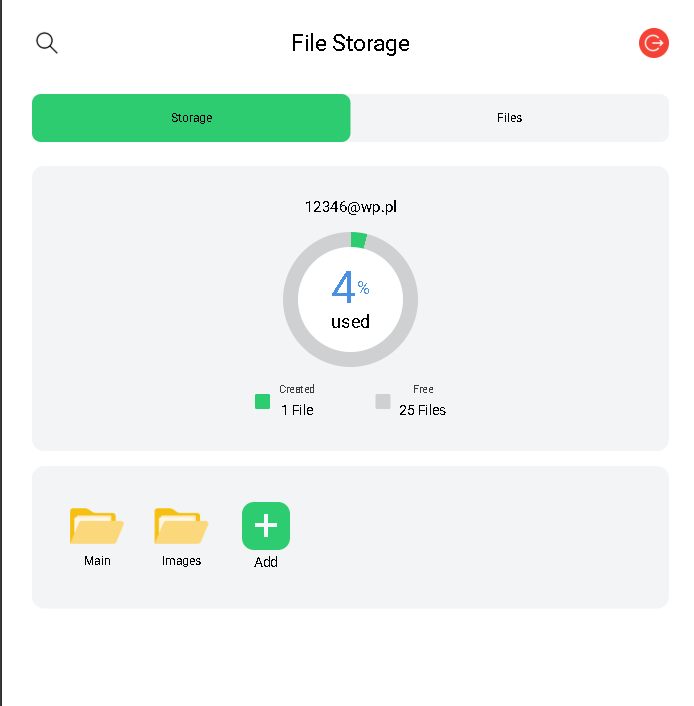
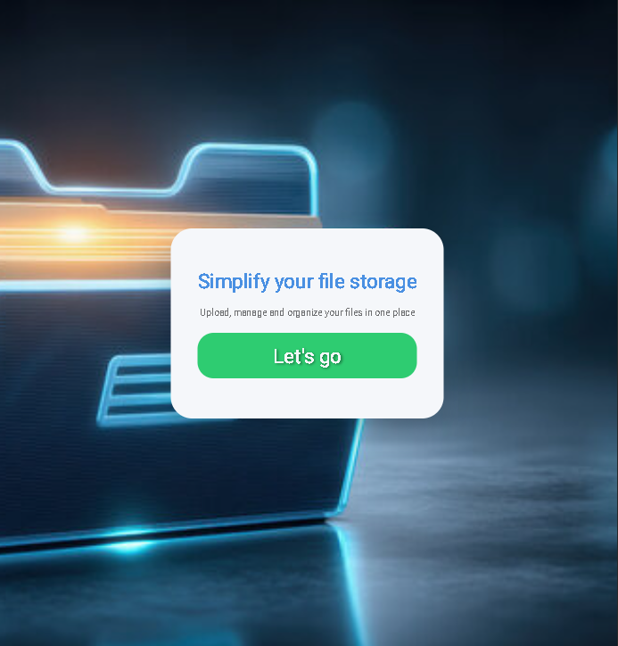

## File storage

## Description
A SaaS application for uploading and managing files in a personal cloud environment.  
Each user has their own isolated storage space.  
The project uses **Neon Database** for data storage and **Cloudinary** for file hosting.  
Built as part of **The Odin Project** curriculum.

## Technologies
- Express  
- Passport  
- Multer  
- Prisma  
- Dotenv  
- Bcrypt  
- TailwindCSS  

## Features
 - Search files by name  
- Create and delete folders  
- Upload files  
- Preview and download files  
- User registration and authentication 

## Live Preview
https://file-uploader-psi-three.vercel.app/

## Author
Created by [Hubert Fratczak](https://github.com/hubfrt1337)

## License
This project is licensed under the MIT License. See the [LICENSE](LICENSE) file for details.

